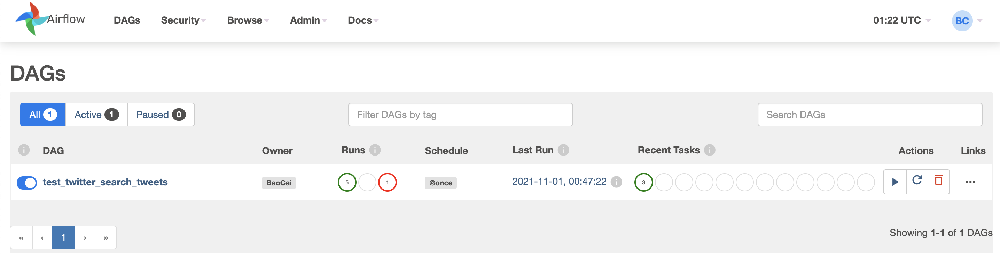
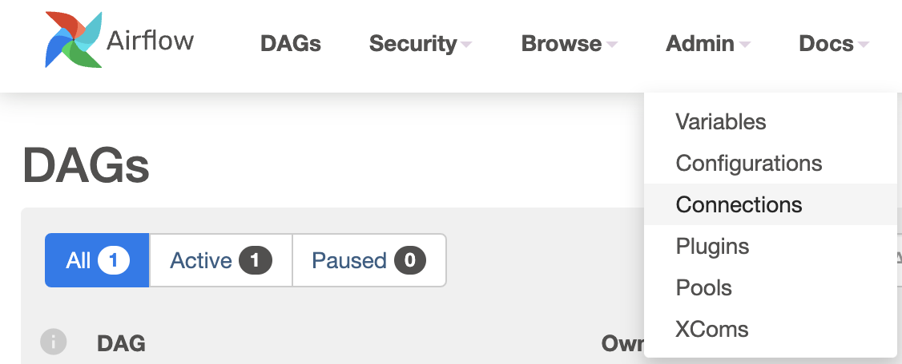
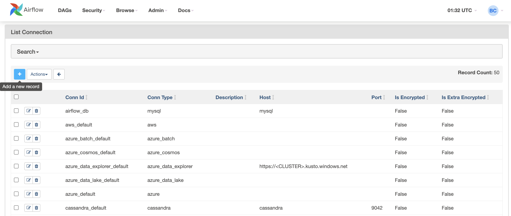
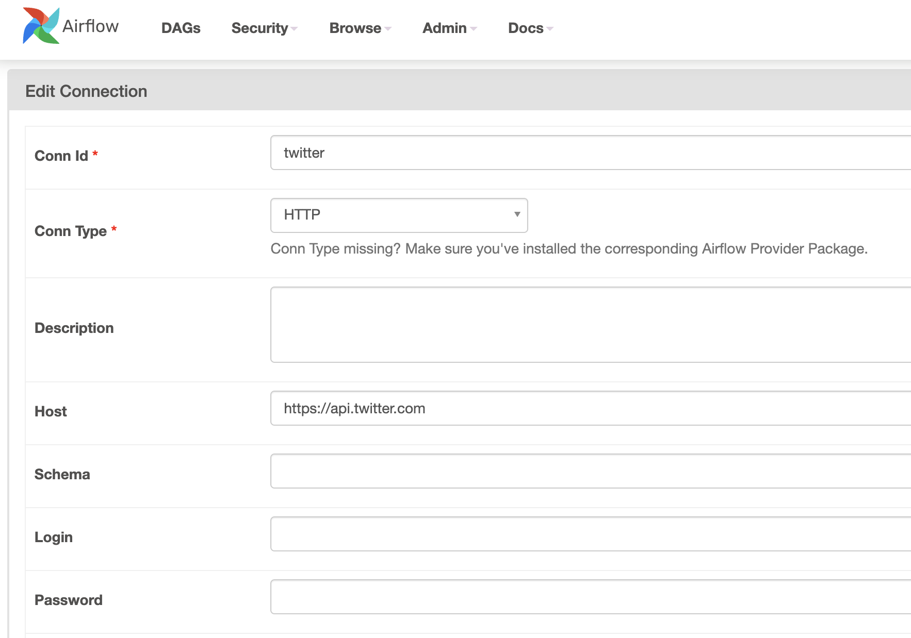
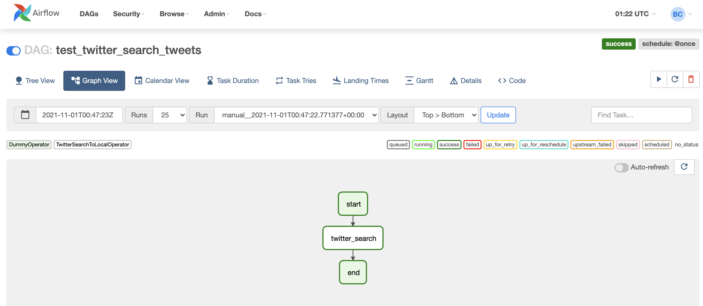
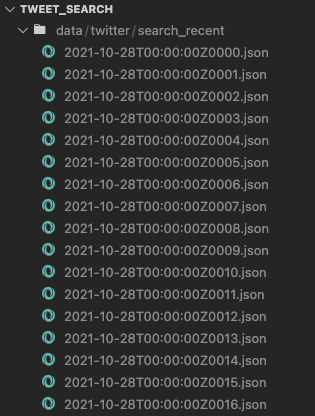

# tweet_search

## Table of contents
1. [Introduction](#introduction)
2. [Run script](#run-script)
3. [Run Airflow](#run-airflow)

## Introduction <a name="introduction"></a>
This repo was a result of a thesis which utilised Tweets for analysis. I thought this would be valuable for anyone who needs to use it to scrape tweets from Twitter, given you have access to the API of course.

## Run script <a name="run-script"></a>
The script is the easier way to get tweets since installing Airflow is not always an option. While this repo started out with Airflow in mind, running script is more recommended. Unless you want to see how badly I made the Airflow Operator of course.

For this to work you need a few things:
- Run `pip install -r requirements.txt`
- An `.env` file at the script location with 1 variable inside, `TOKEN`. This is your API token
- A data folder to house the output. This can be any folder, but you need a `backup` folder living inside it
- Additionally, you can also provide a keywordd file in a predefined location instead of providing them as a string

Run the script, example:
```sh
python tweet_search_to_same_file.py -s 2017-01-01 -e 2017-02-01 -kwf kw.txt -d data/ -l fi -g FI
```
For more details, run:
```sh
python tweet_search_to_same_file.py -h
```

## Run Airflow <a name="run-airflow"></a>
### 0. Install airflow
Install airflow by running `bash install.sh`

It's recommended to use python 3.8 and above because a lot of bugs was fixed for 3.8 but not 3.7

It's also recommended to use 2.1.2 at this point since it's more stable currently

### 1. Setup environment
After installation, don't run anything yet, but choose a directory as airflow home and run:

```bash
export AIRFLOW_HOME=/absolute/path/to/desired/directory
```

Or a more robust way is to add that same line to either `.bashrc` or `.zshrc` at your root directory, depending on what you're using for your terminal

Run this to initiate airflow home:
```bash
airflow version
```

Initiate airflow db:
```bash
airflow db init
```

Create user:
```bash
airflow users create --username admin --firstname first --lastname last --role Admin --email first.last@domain.com
```

Go to your airflow home and find the `airflow.cfg` file:
```bash
cd $AIRFLOW_HOME
ls
```

Change `dags_folder` to the dags folder inside src

Change `plugins_folder` to the plugins folder inside src

Change `load_examples` to False if you don't want to be overloaded

### 2. Change a couple of things in the dag
Change the `DIR` variable to a desirable directory

Change whatever else you want, but check the docstring, which is non-existence atm.

### 3. Run airflow webserver and add connection
Some steps can be automated, like setting the new connection, but for the time being, this is how it would go

Start the webserver:
```bash
airflow webserver --port 8080
```
Airflow is now available at `localhost:8080`

Go to web server and you should see this


Next, navigate to the connection panel in Admin


Add new connection


Put the API access token to the password field


### 4. Let's run the dag
On another terminal, start the scheduler:
```bash
airflow scheduler
```

The test dag currently is configured to be run only once, the actual production one should be scheduled. For now we can trigger it manually for testing.

Turn the dag on and it should run just fine:


### 5. Results
For a 24 hours period, it should output a few files, each with tens of rows like below. When we do schedule this with a better access token and an actual schedule, it should do this automatically.

